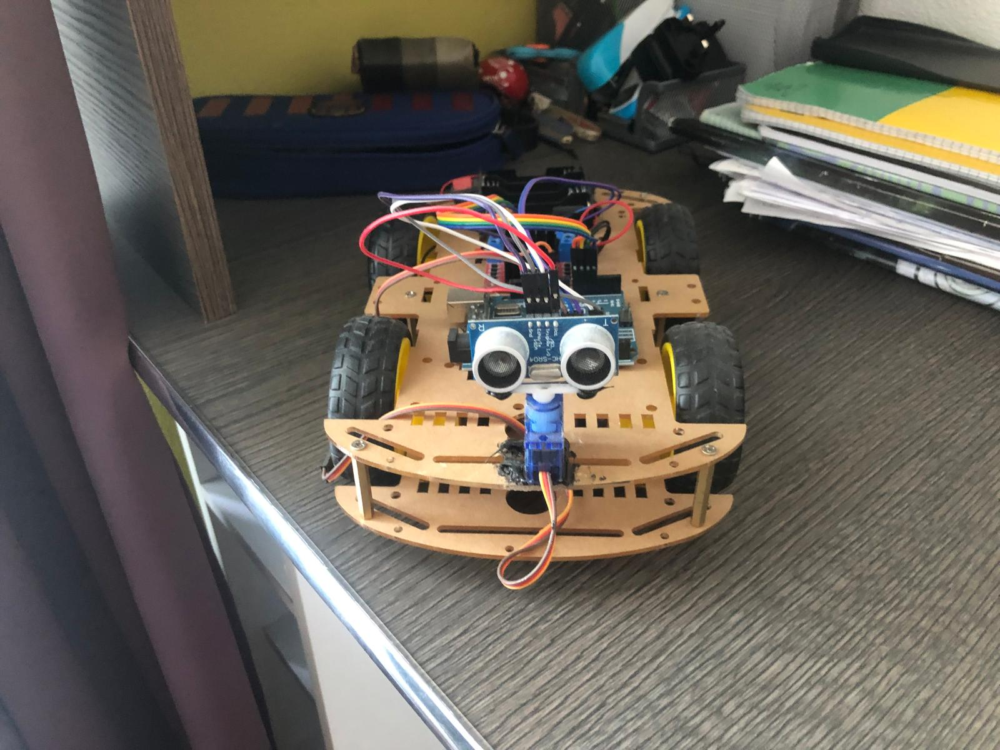

### 🤖 Obstacle Avoiding Robot

I built an autonomous robot using Arduino Uno and ultrasonic sensors to detect and avoid obstacles in real time. I worked mainly on the hardware setup, wiring the components and assembling the robot chassis. The control logic was programmed in C++ using the Arduino IDE. This project helped me understand embedded systems and sensor integration for robotics.

**Technologies:** Arduino Uno, Ultrasonic Sensors, L298N Motor Driver, C++ (Arduino IDE)

### 🔧 Hardware Implementation

The robot was designed and assembled using basic electronic components and a modular chassis. I personally handled the full hardware setup, from wiring to mounting the sensors and motors.

#### Main Tasks:
- Connected the **ultrasonic sensor (HC-SR04)** to the Arduino Uno to detect obstacles by measuring distance using sound waves.
- Wired the **L298N motor driver** to control two **DC motors**, enabling forward, left, and right movement based on sensor feedback.
- Mounted all components on a lightweight chassis with two wheels and a caster wheel for balance.
- Ensured correct power supply using batteries to independently power the motors and the Arduino board.
- Verified signal flow and tested component response before running the control code.

#### Components Used:
| Component              | Function                                      |
|------------------------|-----------------------------------------------|
| Arduino Uno            | Central controller for processing logic       |
| HC-SR04 Sensor         | Measures distance to nearby objects           |
| L298N Motor Driver     | Controls motor direction and speed            |
| 2× DC Motors + Wheels  | Provide movement to the robot chassis         |
| Caster Wheel           | Stability for movement and turning            |
| Battery Pack           | Powers motors and Arduino                     |
| Jumper Wires, Breadboard | Electrical connections and prototyping       |

This hands-on hardware experience helped me better understand circuit design, sensor integration, and real-world implementation of autonomous behavior.

<!-- Optional image if you have one -->
<!-- ![Robot Photo] 

